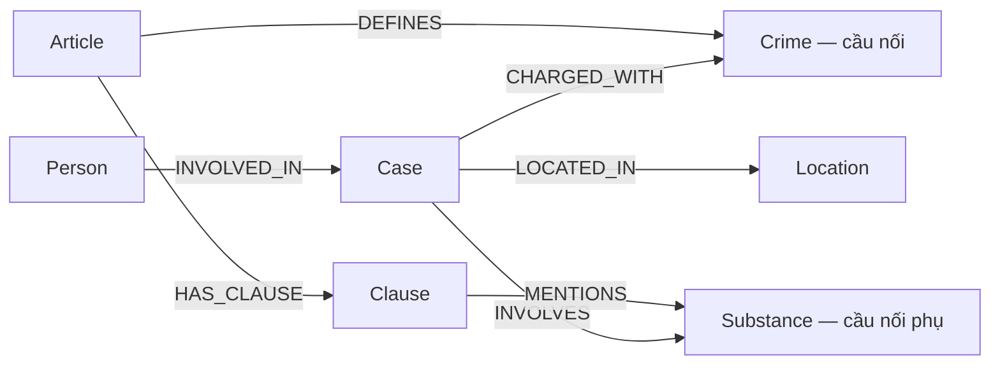

# Thiết kế ontology — Day 19

**Họ tên:** Nguyễn Minh Lương · **MSSV:** 2A202602618
**Lựa chọn:** Tự thiết kế dựa trên các loại node gợi ý, đổi khóa vụ án/người theo nguồn, chuẩn hóa chất và ghi giai đoạn tố tụng.

## 1. Sơ đồ

## 2. Entity types

| Label | Ý nghĩa | Khóa `MERGE` | Properties | KB | Trích bằng |
| --- | --- | --- | --- | --- | --- |
| Article | Điều luật | `id` | `title`, `law`, `doc_id` | Luật | metadata, regex |
| Clause | Khoản luật | `id` = điều + khoản | `number`, `penalty`, `text`, `doc_id` | Luật | regex |
| Crime | Tội danh chuẩn, cầu nối | `name` | `name` | Cả hai | tên Điều luật + LLM, `link_entity` |
| Substance | Chất chuẩn, cầu nối phụ | `name` | `name` | Cả hai | regex + LLM, bảng đồng nghĩa |
| Case | Vụ trong một bài | `id` = `doc_id#case-N` | `name`, `summary`, `date`, `stage`, `doc_id`, `source_title` | Tin | LLM; ID từ mã bài, thứ tự |
| Person | Người trong một bài | `id` = `doc_id#person-` + tên chuẩn | `name`, `aliases`, `doc_id` | Tin | LLM; ID từ mã bài, tên |
| Location | Địa điểm dùng chung | `name` | `name` | Tin | LLM |

`Crime`, `Substance`, `Location` là node dùng chung, không thể gán một `doc_id` duy nhất. Mọi node thuộc riêng một tài liệu có `doc_id = Document.id`. Tất cả khóa trên có constraint `IS UNIQUE`.

## 3. Relationships

| Type | Từ → Đến | Properties cạnh | Ý nghĩa |
| --- | --- | --- | --- |
| `DEFINES` | Article → Crime | — | Điều quy định tội |
| `HAS_CLAUSE` | Article → Clause | — | Khoản thuộc điều |
| `MENTIONS` | Clause → Substance | — | Khoản nhắc chất |
| `CHARGED_WITH` | Case → Crime | — | Tội danh trong vụ |
| `INVOLVES` | Case → Substance | `amount` | Chất và lượng trong vụ |
| `LOCATED_IN` | Case → Location | — | Địa điểm vụ |
| `INVOLVED_IN` | Person → Case | `role`, `charge`, `sentence` | Vai trò và mức án |

## 4. Cầu nối giữa hai KB

`Crime` là cầu nối chính: Điều luật định nghĩa tội, vụ án liên quan tội. `Substance` là cầu nối phụ để tìm khoản và tổng hợp vụ MDMA. `link_entity` chuẩn hóa hai phía, khớp chính xác rồi mới fuzzy ở ngưỡng 0,8. Prompt đưa danh sách tội/chất chuẩn. `Heroin`/`Heroine`, `thuốc lắc`/`MDMA`, `ma túy đá`/`Methamphetamine` được gộp trước `MERGE`.

Cầu gãy khi LLM không trả JSON hợp lệ, không trích được tội tương ứng, hoặc bài chỉ nói hội nghị/chính sách. Cần kiểm output trích xuất và đối chiếu văn bản nguồn; không tự gán tội nếu thiếu bằng chứng. Vụ vẫn có thể nối qua chất khi tội danh không trích được.

## 5. Thứ và quan hệ quan sát được

Đã đối chiếu Điều 251, tin về Lê Minh Thành, Cái Quang Huy, Hoàng Nato, vụ 36kg và sáu câu benchmark.

| Thứ/quan hệ | Luật | Tin | Cả hai? |
| --- | :---: | :---: | :---: |
| Điều, khoản, khung hình phạt, ngưỡng khối lượng | ✓ | | |
| Tội danh mua bán/vận chuyển/tổ chức sử dụng | ✓ | ✓ | **Có** |
| Chất ma túy, nhất là MDMA/Ketamine | ✓ | ✓ | **Có** |
| Vụ việc, người, bí danh, địa điểm, vai trò, bản án, giai đoạn | | ✓ | |
| Điều định nghĩa tội ↔ vụ liên quan tội | ✓ | ✓ | **Có, qua `Crime`** |
| Khoản nhắc chất ↔ vụ liên quan chất | ✓ | ✓ | **Có, qua `Substance`** |

## 6. Competency questions

| Câu | Đường đi | Trả lời được? |
| --- | --- | --- |
| Q1 | `Article(doc_id=pcmt-dieu-2)-[:HAS_CLAUSE]->Clause.text` | Có nếu vector chọn đúng điều; định nghĩa nằm trong văn bản. |
| Q2 | `Person(sentence chứa "tử hình")-[:INVOLVED_IN]->Case(vụ 36kg)` | Có nếu trích đúng hai người và mức án. |
| Q3 | `Person(Lê Minh Thành)-[:INVOLVED_IN]->Case-[:CHARGED_WITH]->Crime<-[:DEFINES]-Article(251)-[:HAS_CLAUSE]->Clause(1)` | Có. |
| Q4 | `Person(aliases chứa Hoàng Nato)-[:INVOLVED_IN]->Case-[:CHARGED_WITH]->Crime<-[:DEFINES]-Article(255)-[:HAS_CLAUSE]->Clause(4)` | Có nếu nhận đúng bí danh/tội. |
| Q5 | `Person(Cái Quang Huy)-[:INVOLVED_IN]->Case-[:INVOLVES {amount}]->Substance(MDMA)<-[:MENTIONS]-Clause(4)<-[:HAS_CLAUSE]-Article(250)` và `Case→Crime←Article` | Có dữ kiện; phép so 9,6kg ≥ 100g còn do LLM đọc văn bản khoản. |
| Q6 | `Substance(MDMA)<-[:INVOLVES]-Case<-[:INVOLVED_IN]-Person` | Có nếu trích đủ MDMA từ các tin. |

## 7. Quyết định, đánh đổi và so với gợi ý

| Khác biệt | Gợi ý | Thiết kế này | Vấn đề giải quyết / bằng chứng |
| --- | --- | --- | --- |
| Khóa `Case` | Tên LLM đặt | `doc_id#case-N` | Hai vụ cùng tên ở hai bài không bị gộp nhầm. `MATCH (k:Case) RETURN count(k), count(DISTINCT k.id)` phải bằng nhau. Cùng vụ ở hai bài còn tách. |
| Khóa `Person` | Tên người | `doc_id#person-<tên>` | Người trùng tên ở hai bài không gộp nhầm. `MATCH (p:Person) RETURN count(p), count(DISTINCT p.id)` phải bằng nhau. Cùng người qua nhiều bài chưa liên kết. |
| Tên chất | Nguyên dạng LLM | `canonical_substance` | `Heroin`/`Heroine`, `thuốc lắc`/`MDMA` cùng node. Q6 có `recall` 0,33 với gợi ý và 1,00 với thiết kế này; câu trả lời mới nêu đủ Cái Quang Huy, Lê Minh Thành và Viện Pháp y. `judge` đều 2, nên lợi ích đo được là ở tên/độ phủ theo keyword. |
| Giai đoạn | Không có | `Case.stage` | Phân biệt bắt giữ, truy tố, xét xử. Suy từ tiêu đề/tóm tắt nên vẫn phải kiểm nguồn. |

Đối chứng dùng cùng dữ liệu, Gemini 3.5 Flash-Lite, top-k 3 và cùng mã truy hồi/đặt prompt; chỉ thay cách `MERGE` và chuẩn hóa thực thể qua adapter `src_hint`. File kết quả: `ket_qua_benchmark_kg.hint.txt` so với `ket_qua_benchmark_kg.txt`. Gợi ý đạt `recall` trung bình 0,89; thiết kế này 1,00. `judge` đều 2,00 nên không khẳng định cải thiện judge. Graph gợi ý có 203 node/380 cạnh; graph này có 207 node/376 cạnh ở lần benchmark. Trên graph này, `count(k)=count(DISTINCT k.id)=13` và `count(p)=count(DISTINCT p.id)=49`; baseline không có khóa `id` cho hai label đó. Khóa theo nguồn đánh đổi bằng việc Cái Quang Huy thành hai node, được phân tích ở báo cáo E3.

## 8. Hạn chế

Chưa mô hình hóa ngưỡng gam/kg thành quan hệ định lượng, nên Q5 cần LLM đọc khoản 4. `Case.stage` có thể sai nếu bài nhắc nhiều giai đoạn. Khóa theo tài liệu tránh gộp nhầm nhưng chưa hợp nhất cùng vụ hoặc người qua nhiều bài.
